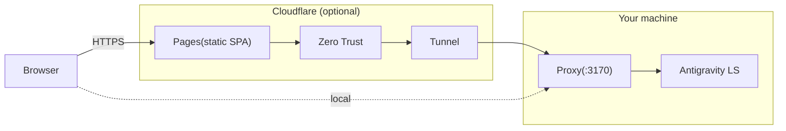

# Porta Mobile

**English** | [中文](README_CN.md)

[](https://github.com/L1M80/porta/actions/workflows/ci.yml)
[](LICENSE)


Enhanced mobile interface for [Antigravity](https://antigravity.google/) — access your local Antigravity sessions from your phone or tablet through a lightweight LSP bridge.

Based on [porta](https://github.com/L1M80/porta) by L1M80 (MIT License), with improvements focused on real-world usability, mobile experience, and CJK language support.

## What's Different from Upstream

This fork includes the following improvements over the [original porta](https://github.com/L1M80/porta):

| Feature | Description |
|---|---|
| **Antigravity 2.0 Support** | Compatible with both Antigravity 1.x and 2.0 (standalone hub mode, `source` field injection) |
| **Multi-Instance IDE Selector** | Switch between multiple running Antigravity instances from the sidebar |
| **Manual Refresh Button** | Refresh conversation list instantly from the sidebar — no need to wait for auto-polling |
| **Mobile Input Fix** | Fixed input bar being cut off on mobile due to soft keyboard and fullscreen gesture bar (dynamic viewport height + safe area insets) |
| **WebSocket Real-time Streaming** | Agent responses now stream in real-time via WebSocket, instead of requiring manual refresh |
| **Command Approval Fix** | Fixed RPC field mapping errors that broke the approve/reject flow for agent-proposed commands |
| **Image Display** | Images uploaded from the IDE are now visible in the mobile interface (via proxy file endpoint) |
| **Model Selector Sorting** | Model list is now sorted by label for consistent ordering |
| **New Conversation Sync** | Conversations created in Porta are synced back to the IDE via `SendActionToChatPanel` RPC |
| **CJK Workspace Names** | Fixed garbled Chinese/Japanese/Korean characters in workspace names (URI percent-encoding decode) |
| **Font Size Control** | Adjustable font size from the sidebar, using `rem`-based scaling for cross-browser compatibility |
| **LAN-Ready by Default** | Vite dev server binds to all interfaces (`host: true`), no extra flags needed for LAN access |
| **Background Startup** | Included scripts for silent background startup and Windows auto-start at boot |

## Changelog

- **2026-06-01** — Merged latest upstream changes from [porta](https://github.com/L1M80/porta); added Antigravity 2.0 compatibility, multi-instance IDE selector, manual refresh button; fixed mobile input truncation on fullscreen devices

## Quick Start

**Prerequisites**: [Node.js](https://nodejs.org/) ≥ 22, [pnpm](https://pnpm.io/) ≥ 10, and a running [Antigravity](https://antigravity.google/) instance.

> **Note:** Porta is a bridge to Antigravity. If Antigravity is not running, the proxy will start but cannot connect to any session.

```bash
git clone https://github.com/SANG4242/porta-mobile.git
cd porta-mobile
pnpm install
cp .env.example .env   # edit to match your setup
pnpm dev               # proxy (:3170) + web (:5173)
```

Open `http://localhost:5173` in your browser.

### LAN / Remote Access

To access from your phone or another device on your network, edit `.env`:

```bash
# Set to this machine's LAN IP (or ZeroTier/Tailscale IP)
PORTA_HOST=192.168.1.23

# Allow the web UI to connect WebSocket directly to the proxy
VITE_WS_BASE=ws://192.168.1.23:3170

# Allow CORS from the web UI origin
PORTA_CORS_ORIGINS=http://192.168.1.23:5173
```

Then open `http://192.168.1.23:5173` on your phone.

> **Tip:** For access outside your home network, you can use [ZeroTier](https://www.zerotier.com/) or [Tailscale](https://tailscale.com/) to create a virtual LAN between your devices. Set `PORTA_HOST` to the virtual IP assigned by your VPN.

### Background Startup (Windows)

To run Porta silently in the background:

1. Edit `start_porta.bat` — update the paths to match your setup
2. Double-click `start_porta.vbs` to start without a visible window
3. (Optional) Copy a shortcut to `start_porta.vbs` into `shell:startup` for auto-start at boot

To stop: open Task Manager, find `node.exe` processes, and end them.

## How It Works

```
Phone Browser → Porta Web UI (:5173) → Porta Proxy (:3170) → Antigravity Language Server
```

Porta doesn't stream pixels or run your workspace in the cloud. It relays structured conversation data through the Antigravity Language Server Protocol:

- **Near-zero bandwidth**: JSON messages, not video frames
- **Real-time streaming**: WebSocket push, no polling
- **Installable PWA**: add to home screen for a native app feel (see [PWA setup](docs/pwa.md) — a one-time browser flag is needed for HTTP/LAN)
- **Full privacy**: your code and conversations never leave your machine

## Configuration Reference

| Variable | Default | Description |
|---|---|---|
| `PORTA_HOST` | `127.0.0.1` | IP to bind the proxy. Use a LAN/VPN IP for remote access |
| `PORTA_PORT` | `3170` | Proxy port |
| `PORTA_CORS_ORIGINS` | *(empty)* | Comma-separated allowed origins for CORS |
| `VITE_WS_BASE` | *(empty)* | WebSocket URL for direct proxy connection (e.g. `ws://192.168.1.23:3170`). Required when accessing from a remote device |
| `VITE_API_BASE` | *(empty)* | API URL for production builds (Cloudflare deployment) |

## Limitations

- **Antigravity must be running** — Porta is a bridge, not a standalone tool
- **Chat only** — no code editing or terminal access; use your local editor for that
- **Same-side requirement** — the proxy must run on the same machine (or same environment, e.g. not WSL2 vs Windows host) as Antigravity
- **Mixed conversation history with 2.0** — Antigravity 1.x and 2.0 store conversations in the same global directory. When both versions are running, the conversation list may show entries from both, and pinning to a specific 2.0 instance can cause read delays. Switching to "auto" mode resolves most issues

## Documentation

- [中文文档 (Chinese README)](README_CN.md)
- [AI Deployment Guide](docs/ai-deployment-guide.md) / [AI 部署指南](docs/ai-deployment-guide_cn.md)
- [PWA Installation](docs/pwa.md)

## Credits

This project is based on [porta](https://github.com/L1M80/porta) by [L1M80](https://github.com/L1M80), licensed under the [MIT License](LICENSE).

Thanks to the [LINUX DO](https://linux.do/) community for support and feedback.

## Remote access with Cloudflare



- **Local-only mode** (Quick start above): Browser → Proxy → LS. No cloud services needed.
- **Remote mode**: Cloudflare Pages + Tunnel + Zero Trust for secure remote access without exposing your network.

Cloudflare can be used in two different ways:

### Option A: Quick Tunnel (temporary testing)

If you only want to try Porta remotely and do not need a stable hostname, use a
Cloudflare Quick Tunnel.

- No custom domain required
- Best for demos and short-lived testing
- Not recommended for ongoing use: the hostname is temporary, and Cloudflare documents Quick Tunnels as testing-only infrastructure

To avoid stale copy-pasted instructions, follow Cloudflare's current docs:

- [Quick Tunnels](https://developers.cloudflare.com/cloudflare-one/networks/connectors/cloudflare-tunnel/do-more-with-tunnels/trycloudflare/)
- [Cloudflare Tunnel setup](https://developers.cloudflare.com/tunnel/setup/)

Use a named tunnel instead if you want a stable `VITE_API_BASE`, a fixed Cloudflare
Pages deployment, or long-lived remote access.

### Option B: Named tunnel + Pages (recommended for regular remote use)

This is the stable pattern for ongoing remote access. It requires:

- A **Cloudflare** account
- **Cloudflare Tunnel** (`cloudflared`) installed and authenticated
- A **Cloudflare Pages** project (for hosting the static SPA)
- A domain managed by **Cloudflare** for the tunnel hostname
- Optionally, **Cloudflare Zero Trust** for authentication

### 1. Configure `.env`

Set the proxy runtime and Cloudflare-related variables in `.env`:

```bash
# .env
PORTA_CORS_ORIGINS=https://<YOUR_PAGES_DOMAIN>
PORTA_TUNNEL_NAME=<YOUR_TUNNEL_NAME>
PORTA_CF_PROJECT=<YOUR_PROJECT_NAME>
```

### 2. Create the named tunnel

Point the tunnel at your local proxy:

```bash
cloudflared tunnel create <YOUR_TUNNEL_NAME>
cloudflared tunnel route dns <YOUR_TUNNEL_NAME> <YOUR_API_SUBDOMAIN>
```

### 3. Create `.env.production`

Create `.env.production` in the repo root for the web build:

```bash
# .env.production
VITE_API_BASE=https://<YOUR_API_SUBDOMAIN>
```

### 4. Build and deploy the SPA

```bash
pnpm deploy
```

This uses `PORTA_CF_PROJECT` from `.env`. If you prefer, you can run the
equivalent `wrangler pages deploy` command manually.

### 5. Start the proxy + named tunnel

```bash
pnpm dev:cloud
```

This reads `PORTA_TUNNEL_NAME` from `.env` and starts the proxy and
`cloudflared tunnel run` together.

### 6. Securing your API with Cloudflare Access (Zero Trust)

Exposing your local API to the public internet can be dangerous. To completely lock down your setup, you should protect **both** your frontend and your API using Cloudflare Access. 

Porta's built-in Edge Proxy securely bridges the two by injecting Machine-to-Machine authentication tokens, completely hiding your backend from the internet.

To set this up, follow these precise steps:

**1. Create Two Separate Applications**
In your **Cloudflare Zero Trust** dashboard, under **Access > Applications**, you must create **two** distinct applications:
- **Frontend App**: Protects your Pages deployment (e.g., `https://<YOUR_PAGES_DOMAIN>`). Configure this with standard user login policies (e.g., email OTP).
- **Backend API App**: Protects your Tunnel (e.g., `https://<YOUR_API_SUBDOMAIN>`). 

**2. Generate Service Tokens**
1. Navigate to **Access > Service Auth**.
2. Create a new Service Token for Porta. This will generate a **Client ID** and **Client Secret**.

**3. Add the Service Auth Policy to the Backend API**
1. Open the **Backend API App** you created in Step 1.
2. Go to the **Policies** tab and add a new policy.
3. Set the action to **Service Auth**.
4. In the rules, configure it to **Include > Service Token** and select the token you just created.

**4. Configure Cloudflare Pages Environment Variables**
1. Go to your **Cloudflare Pages** dashboard for `<YOUR_PROJECT_NAME>`.
2. Under **Settings > Environment variables**, add the following **three** variables to **both Production and Preview** environments:
   - `PORTA_API_BASE`: Set this to your exact API URL (e.g., `https://<YOUR_API_SUBDOMAIN>`).
   - `CF_ACCESS_CLIENT_ID`: The Client ID from Step 2.
   - `CF_ACCESS_CLIENT_SECRET`: The Client Secret from Step 2.

**5. Route Frontend Traffic Through the Proxy**
By default, the Porta frontend tries to fetch the API directly. To force it to use the secure Edge Proxy:
1. In your `.env.production` file, **remove or comment out** `VITE_API_BASE`. 
2. Without `VITE_API_BASE`, the frontend falls back to relative paths (`/api/*`), routing traffic through the Cloudflare Pages Edge proxy.
3. Run `pnpm deploy` again.

> **Backwards Compatibility Note:** If `VITE_API_BASE` is defined, the frontend will bypass the proxy entirely and attempt to communicate directly with the backend. This is fully supported and recommended for local development (LAN access) or deployments where the backend is not protected by Cloudflare Access. Additionally, the proxy will gracefully skip Service Token injection if the `CF_ACCESS_CLIENT_ID` environment variables are missing.

## Contributing

See [CONTRIBUTING.md](CONTRIBUTING.md) for development workflow, branch
strategy, and PR guidelines.

## Security

To report a vulnerability, see [SECURITY.md](SECURITY.md).

## License

[MIT](LICENSE)
