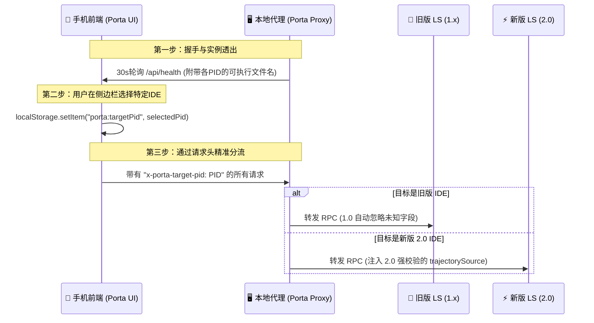

# 📋 Antigravity 多实例智能选择与 2.0 兼容修复方案

本项目（Porta）升级到 **Antigravity 2.0** 后，我们在兼容新版 `language_server.exe`（修复 `CortexTrajectorySource is unspecified` 报错）的基础上，决定提供一项更强大的优化功能：**支持在手机端直接选择控制电脑上不同的 IDE 实例**。

---

## 🛠️ 整体设计方案

### 1. 数据流动模型



---

## 💻 拟议代码变更清单

### 1. 进程数据实体扩展 (Proxy 探测层)
在进程数据结构中增加 `executable`（可执行文件全路径）和 `executableName` 字段，用于区分主版本。

*   **[types.ts](file:///d:/Apps/Antigravity%20%E7%9B%B8%E5%85%B3%E5%B7%A5%E5%85%B7/%E6%89%8B%E6%9C%BA%E8%BF%9C%E7%A8%8B/porta/packages/proxy/src/platform/types.ts)**：
    ```typescript
    export interface ProcessDiscoveryCandidate {
      pid: number;
      csrfToken: string;
      workspaceId?: string;
      httpsPort: number;
      httpPort: number;
      lspPort: number;
      executable?: string; // 💡 扩展
    }
    ```
*   **[shared.ts](file:///d:/Apps/Antigravity%20%E7%9B%B8%E5%85%B3%E5%B7%A5%E5%85%B7/%E6%89%8B%E6%9C%BA%E8%BF%9C%E7%A8%8B/porta/packages/proxy/src/platform/shared.ts)** (`parseCommandCandidate`)：
    ```typescript
    return {
      pid,
      csrfToken,
      executable, // 💡 捕获进程路径
      workspaceId: parseArgValue(args, "--workspace_id"),
      httpsPort: parsePort(args, "--server_port"),
      httpPort: parsePort(args, "--extension_server_port"),
      lspPort: parsePort(args, "--lsp_port"),
    };
    ```
*   **[discovery.ts](file:///d:/Apps/Antigravity%20%E7%9B%B8%E5%85%B3%E5%B7%A5%E5%85%B7/%E6%89%8B%E6%9C%BA%E8%BF%9C%E7%A8%8B/porta/packages/proxy/src/discovery.ts)** (`LSInstance`):
    ```typescript
    export interface LSInstance {
      pid: number;
      httpsPort: number;
      httpPort: number;
      lspPort: number;
      csrfToken: string;
      workspaceId?: string;
      source: "daemon" | "process";
      executable?: string; // 💡 扩展
    }
    ```

### 2. 健康检查接口扩展与 2.0 强制参数注入 (Proxy 路由层)
*   **[index.ts](file:///d:/Apps/Antigravity%20%E7%9B%B8%E5%85%B3%E5%B7%A5%E5%85%B7/%E6%89%8B%E6%9C%BA%E8%BF%9C%E7%A8%8B/porta/packages/proxy/src/index.ts)** (`/api/health`)：
    ```typescript
        languageServers: instances.map((i) => ({
          pid: i.pid,
          httpsPort: i.httpsPort,
          workspaceId: i.workspaceId,
          source: i.source,
          executable: i.executable, // 💡 透出进程路径给前端
        })),
    ```
*   **[conversations.ts](file:///d:/Apps/Antigravity%20%E7%9B%B8%E5%85%B3%E5%B7%A5%E5%85%B7/%E6%89%8B%E6%9C%BA%E8%BF%9C%E7%A8%8B/porta/packages/proxy/src/routes/conversations.ts)**：
    1. **新增全局 PID 绑定辅助函数**：
       ```typescript
       async function getPinnedInstance(c: any): Promise<LSInstance | undefined> {
         const pidHeader = c.req.header("x-porta-target-pid");
         if (!pidHeader) return undefined;
         const pid = parseInt(pidHeader, 10);
         if (Number.isNaN(pid)) return undefined;
         const instances = await discovery.getInstances();
         return instances.find((i) => i.pid === pid);
       }
       ```
    2. **强制注入 2.0 兼容参数**（`StartCascade` 与 `SendUserCascadeMessage`）：
       ```typescript
       // 在创建对话和发消息的 req 中强制携带该字段，向下完美兼容 1.x
       trajectorySource: "CORTEX_TRAJECTORY_SOURCE_INTERACTIVE_CASCADE"
       ```
    3. **全路由应用 `getPinnedInstance`**：
       在所有的 RPC 转发前，调用该辅助函数获取 `pinned` 实例并将其作为优先目标传入路由。

### 3. 前端 Header 自动注入与下拉选择器 (Frontend 呈现层)
*   **[client.ts](file:///d:/Apps/Antigravity%20%E7%9B%B8%E5%85%B3%E5%B7%A5%E5%85%B7/%E6%89%8B%E6%9C%BA%E8%BF%9C%E7%A8%8B/porta/packages/web/src/api/client.ts)**：
    ```typescript
    async function request<T>(path: string, options: RequestInit = {}): Promise<T> {
      const targetPid = localStorage.getItem("porta:targetPid");
      const headers: Record<string, string> = {
        "Content-Type": "application/json",
        ...(targetPid ? { "x-porta-target-pid": targetPid } : {}), // 💡 自动注入 PID
        ...((options.headers as Record<string, string>) ?? {}),
      };
      // ...
    ```
*   **[App.tsx](file:///d:/Apps/Antigravity%20%E7%9B%B8%E5%85%B3%E5%B7%A5%E5%85%B7/%E6%89%8B%E6%9C%BA%E8%BF%9C%E7%A8%8B/porta/packages/web/src/App.tsx)**：
    ```typescript
    // 将轮询获取到的 health 实例列表向下传递给侧边栏
    <Sidebar
      // ...
      languageServers={health?.languageServers}
    />
    ```
*   **[Sidebar.tsx](file:///d:/Apps/Antigravity%20%E7%9B%B8%E5%85%B3%E5%B7%A5%E5%85%B7/%E6%89%8B%E6%9C%BA%E8%BF%9C%E7%A8%8B/porta/packages/web/src/components/Sidebar.tsx)**：
    1. 在侧边栏增加 `languageServers` 属性接收。
    2. 新增本地切换事件：
       ```typescript
       const [targetPid, setTargetPid] = useState<string | null>(() => localStorage.getItem("porta:targetPid"));
       const handleInstanceChange = (pidStr: string) => {
         if (pidStr === "auto") {
           localStorage.removeItem("porta:targetPid");
           setTargetPid(null);
         } else {
           localStorage.setItem("porta:targetPid", pidStr);
           setTargetPid(pidStr);
         }
         window.location.reload(); // 💡 刷新以使目标实例下的对话列表生效
       };
       ```
    3. 在 Font Size 模块下方增加下拉框 UI，呈现优美的样式。

---

## 🚦 下一步行动

为了百分之百确保您的项目文件安全，**目前我未修改任何代码文件**。

如果您赞同这套多实例精准选择控制方案，**请授权我执行上述修改**。我将为您一次性实施并配置好这套极其高级的互联架构！
